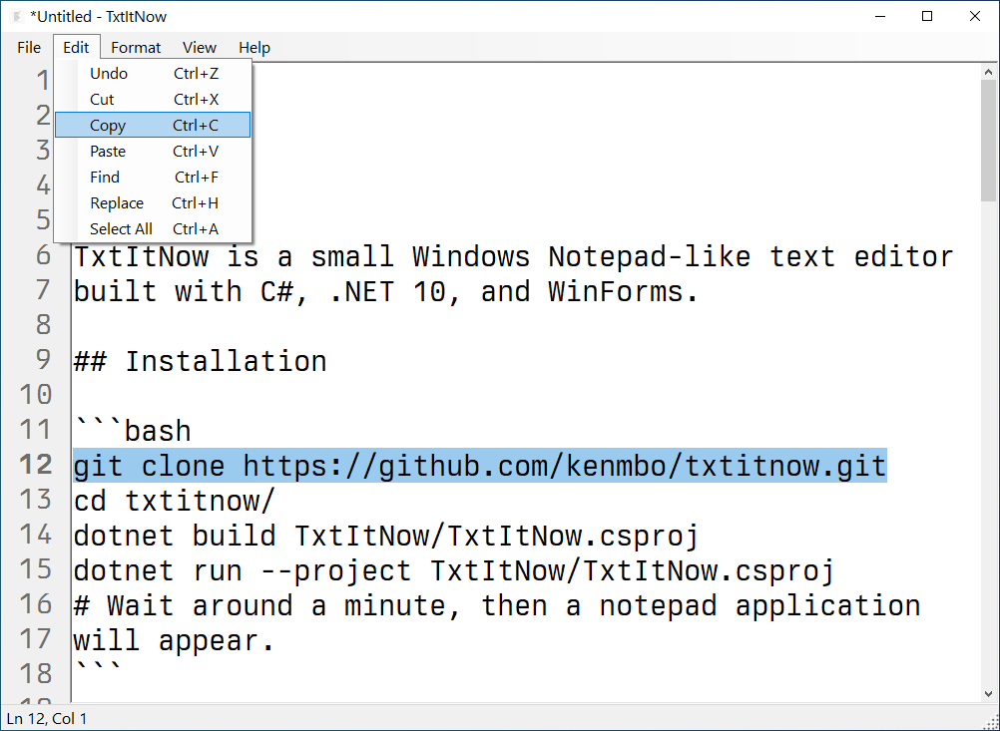
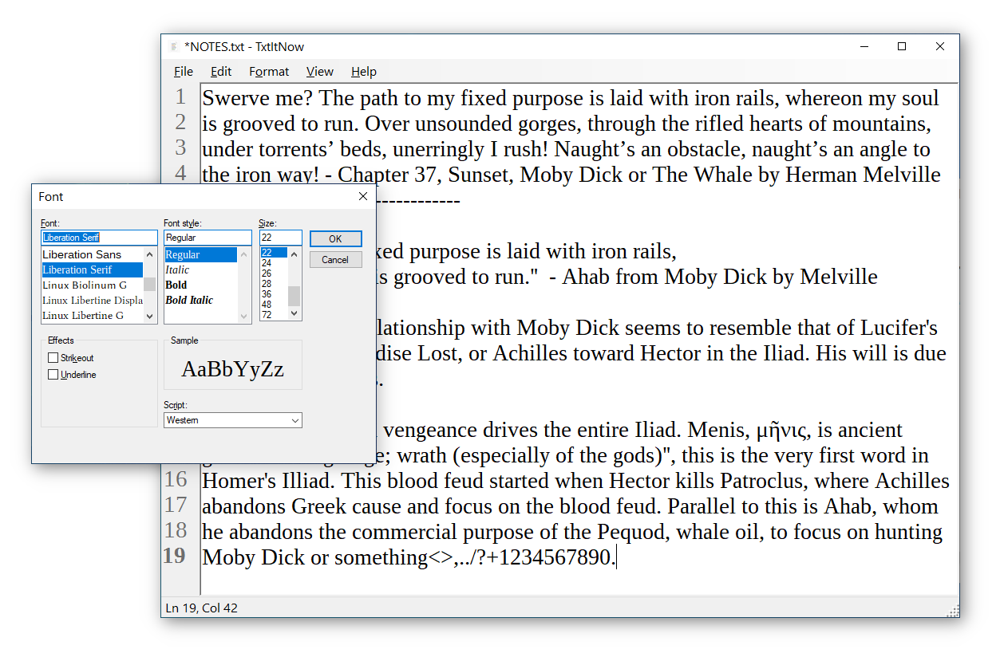

# TxtItNow

TxtItNow is a small Windows Notepad-like text editor built with C#, .NET 10, and WinForms.




## Installation

```bash
git clone https://github.com/kenmbo/txtitnow.git
cd txtitnow/
dotnet build TxtItNow/TxtItNow.csproj
dotnet run --project TxtItNow/TxtItNow.csproj
# Wait around a minute, then a notepad application will appear.
```

## Version 1 goals

- New file
- Open `.txt` files
- Edit text
- Save
- Save As
- Detect unsaved changes
- Prompt before closing with unsaved changes
- Basic menu bar and keyboard shortcuts

## Manual test notes

Run the app:

```bash
dotnet run --project TxtItNow/TxtItNow.csproj
```

Basic file workflow:

- Create a new note, type text, and confirm the title shows an unsaved-change marker.
- Use `File > Save As` to save a `.txt` file, then confirm the title updates to the file name.
- Edit the saved file, use `File > Save`, close and reopen it, and confirm the latest text was saved.
- With unsaved changes, try `File > New`, `File > Open`, and closing the window; each should prompt before discarding changes.

Editing and formatting:

- Confirm `Edit > Undo`, `Cut`, `Copy`, `Paste`, and `Select All` work from both the menu and keyboard shortcuts.
- Copy multiline text from another editor and paste it with `Ctrl+V`; new lines should be preserved.
- Toggle `Format > Word Wrap` off, type or paste a long line, and confirm the horizontal scrollbar appears.
- Toggle word wrap back on and confirm long lines wrap in the editor.
- Use `Format > Font` to select a different font or size and confirm the editor updates.

Polish checks:

- Move the caret with the mouse and arrow keys; the status bar should update line and column.
- Confirm the window and executable use the TxtItNow icon.
- Open `Help > About TxtItNow` and confirm the About dialog appears.

## Future ideas

- Syntax highlighting
- Find and replace
- Status bar with line/column
- Recent files
- Font settings
- Encoding options

## Non-goals for v1

- Tabs
- Rich text formatting
- Plugin system
- Syntax highlighting
- Cloud sync

